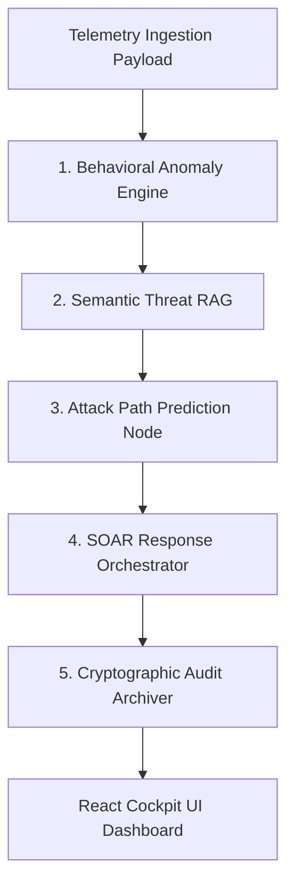

# SentinelAI: Master Manual & Technical Report

This document serves as the Master Manual for SentinelAI, explaining the architectural workflow, selected technologies, operational mechanisms, and explicit alignment with the **Economic Times AI Hackathon 2.0 (Problem Statement 7: AI-Driven Cyber Resilience for Critical National Infrastructure)**.

---

## 1. Hackathon Problem Statement & Judging Matrix Alignment

SentinelAI was built specifically to address **Problem Statement 7**: protecting Critical National Infrastructure (CNI) like AIIMS Delhi and CBSE from sophisticated 2:00 AM low-and-slow APT attacks.

| Judging Criteria (Weight) | How SentinelAI Fulfills the Criteria | Implementation Evidence |
| :--- | :--- | :--- |
| **Technical Excellence (25%)** | 5-agent LangGraph sequential state machine combining unsupervised Isolation Forest ML with Gemini GenAI LLM RAG. | [orchestrator.py](file:///c:/Users/tusha/Desktop/Workspace/Projects/et/server/orchestrator.py), [behavior.py](file:///c:/Users/tusha/Desktop/Workspace/Projects/et/server/agents/behavior.py), [threat_rag.py](file:///c:/Users/tusha/Desktop/Workspace/Projects/et/server/agents/threat_rag.py) |
| **Business Impact (25%)** | Compresses Mean Time To Detect (MTTD) and Respond (MTTR) from weeks/months to seconds via autonomous SOAR containment. | [response.py](file:///c:/Users/tusha/Desktop/Workspace/Projects/et/server/agents/response.py) (`BLOCK_IP`, `ISOLATE_HOST` > 85% threshold) |
| **Scalability (20%)** | Pydantic strict data validation, FastAPI async web router, and modular agent node boundaries preventing context drift. | [schemas.py](file:///c:/Users/tusha/Desktop/Workspace/Projects/et/server/schemas.py), [main.py](file:///c:/Users/tusha/Desktop/Workspace/Projects/et/server/main.py) |
| **User Experience (15%)** | React 19 + Tailwind CSS dark cockpit interface with Top Metrics Bar, 5-agent Pipeline Flow, Incident Feed, and Audit Report. | [App.jsx](file:///c:/Users/tusha/Desktop/Workspace/Projects/et/src/App.jsx), [PipelineFlow.jsx](file:///c:/Users/tusha/Desktop/Workspace/Projects/et/src/components/PipelineFlow.jsx) |
| **Innovation (15%)** | Proactive attack trajectory prediction paired with an immutable audit log trail for non-repudiable judge inspection. | [prediction.py](file:///c:/Users/tusha/Desktop/Workspace/Projects/et/server/agents/prediction.py), [report.py](file:///c:/Users/tusha/Desktop/Workspace/Projects/et/server/agents/report.py) |

---

## 2. Architectural Workflow Overview

SentinelAI processes telemetry logs through 5 cognitive backend agent nodes in sequence:



1. **Telemetry Ingestion:** Receives `LogIngestionPayload` structured by `SecurityLog` Pydantic models.
2. **Behavioral Analysis:** Evaluates logs using `IsolationForest` on `[hour_of_day, command_line_length, is_external_ip]` without relying on signatures.
3. **Semantic RAG:** GenAI maps anomalous logs to MITRE ATT&CK framework techniques (e.g. `T1003 Credential Dumping`, `T1021 Lateral Movement`, `T1048 Exfiltration`).
4. **Attack Path Prediction:** Projects future attack vector trajectories with likelihood percentages (e.g., predicting 95% exfiltration probability).
5. **SOAR Containment & Auditing:** Triggers autonomous host isolation / IP blocks if confidence > 85%, and compiles an immutable transaction audit log trail.

---

## 3. Technology Stack Breakdown & "Why"

| Technology | Role in SentinelAI | Why We Used It |
| :--- | :--- | :--- |
| **Python Virtual Environment (`venv`)** | Dependency isolation | Prevents package conflicts and guarantees reproducible builds. |
| **Pydantic (v2)** | Data validation & serialization | Enforces strict schema models (`SecurityLog`, `LogIngestionPayload`, `AgentDecisionStep`). |
| **Scikit-Learn (sklearn)** | Unsupervised Machine Learning | Implements the `IsolationForest` model to detect non-signature behavioral outliers. |
| **LangGraph (TypedDict)** | Multi-Agent State Orchestration | Centralizes shared state memory (`SentinelAgentState`) across sequential nodes. |
| **Google GenAI SDK** | Semantic RAG Threat Intel Parser | Queries Gemini (`gemini-2.5-flash`) with JSON schema controls for MITRE ATT&CK mapping and report generation. |
| **FastAPI & Uvicorn** | High-performance API backend | Exposes CORS-enabled `/api/analyze-telemetry` endpoint for real-time frontend queries. |
| **React 19 & Tailwind CSS** | Front-End Cockpit Interface | Provides dark-mode visualization, glassmorphism aesthetics, live pipeline animation, and telemetry replay buttons. |

---

## 4. Master Manual & Operational Commands

### A. Environment Activation
```powershell
# Activate local virtual environment
.\.venv\Scripts\Activate.ps1
```

### B. Launching the Backend Server
```powershell
.\.venv\Scripts\python -m uvicorn server.main:app --reload --port 8000
```
*Navigating to `http://127.0.0.1:8000/` will confirm server status: `ONLINE`.*

### C. Launching the Front-End Cockpit
```powershell
npm run dev
```
*Navigating to `http://localhost:5173/` opens the React Dashboard cockpit.*

### D. Testing Telemetry Replay
On the top header bar of the React dashboard, judges can click:
*   🟢 **Run Normal Activity Profile:** Replays benign daytime intranet traffic (`0%` threat index).
*   🔴 **Execute 2:00 AM Attack Infiltration Simulation:** Replays the 4-stage APT attack timeline (Admin login from rogue IP -> PowerShell LSASS dump -> Database share mapping -> Outbound POST spike), activating all 5 agents and executing autonomous SOAR containment within seconds.
